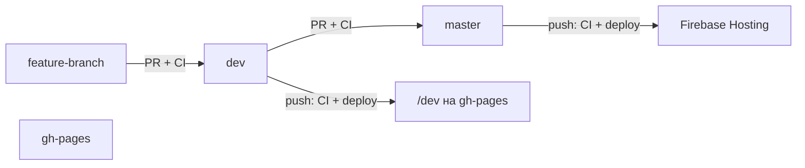

# Bible — правила разработки Simple4U (tutor-app)

Внутренний справочник команды. Следуй этим правилам при любых изменениях в репозитории.

---

## Git-ветки и CI/CD

В репозитории **три ветки**, у каждой своя роль:

| Ветка | Роль | Кто пишет в неё |
|-------|------|-----------------|
| `dev` | Исходный код, тестирование и **единственный источник сборки для gh-pages** | Через PR |
| `master` | Стабильный production-код → **деплой на Firebase Hosting** | **Только через PR** из `dev` |
| `gh-pages` | Собранный статический сайт (артефакты деплоя) | Только GitHub Actions, **не коммить вручную** |

**Все изменения идут через PR → `dev`. Preview на GitHub Pages — из `dev`. После проверки — PR `dev` → `master` → Firebase Hosting (`simple4u-64822.web.app`).**

### Порядок работы

1. **Feature-ветка** от `dev` → PR в `dev` → CI (тесты + build).
2. **Мерж PR в `dev`** → CI снова (тесты + build) → деплой в `gh-pages` (папка `/dev`).
3. **Проверка** — https://wrincied.github.io/tutor-app/dev
4. **PR `dev` → `master`** → CI (тесты + build), без деплоя на gh-pages.
5. **Мерж PR в `master`** → CI → **Deploy to Firebase Hosting** (live: https://simple4u-64822.web.app).



### CI/CD (GitHub Actions)

Один workflow: `.github/workflows/ci.yml`

| Событие | Jobs | Деплой |
|---------|------|--------|
| PR → `dev` | Test & Build | нет |
| PR → `master` | Test & Build | нет |
| push → `dev` | Test & Build → Deploy to GitHub Pages | `gh-pages` → `/dev` |
| push → `master` | Test & Build → Deploy to Firebase Hosting | `simple4u-64822.web.app` |

**Секрет для Firebase:** `FIREBASE_SERVICE_ACCOUNT_TUTORASSIS` (JSON service account с правом Firebase Hosting Admin).

**URL:**

- Preview: https://wrincied.github.io/tutor-app/dev
- Production: https://simple4u-64822.web.app

### Структура GitHub Pages (простыми словами)

GitHub Pages — это **хостинг готового сайта** (HTML/JS), не сервер с API.

```
wrincied.github.io/tutor-app/          ← корень: редирект на /dev
wrincied.github.io/tutor-app/dev/      ← актуальная сборка (открывать это!)
wrincied.github.io/tutor-app/dev/#/login   ← вход
```

| Что | Где живёт |
|-----|-----------|
| Фронтенд (браузер) | `gh-pages` ветка → GitHub Pages |
| Исходный код | ветка `dev` в tutor-app |
| API, база, Stripe | `tutor-app-backend--tutorassis.europe-west4.hosted.app` |
| Production для пользователей | Firebase Hosting: `simple4u-64822.web.app` (деплой из `master`) |

**Цепочка preview:** PR → `dev` → CI собирает Angular → `gh-pages/dev/`.

**Цепочка production:** PR `dev` → `master` → CI → Firebase Hosting live.

**Auth на gh-pages:** Firebase Authorized domain `wrincied.github.io` + OAuth Client JavaScript origin `https://wrincied.github.io`. Подробнее: [Linear doc](https://linear.app/simple4u/document/github-pages-struktura-i-avtorizaciya-wrinciedgithubio-f48efeed151c).

### Обязательные настройки в GitHub

**Settings → Branches → Branch protection rules**

#### Для `dev`

1. **Require a pull request before merging**
2. **Require status checks to pass before merging** → **`Test & Build`**
3. **Require branches to be up to date before merging**

#### Для `master`

1. **Require a pull request before merging**
2. **Require status checks to pass before merging** → **`Test & Build`**
3. **Require branches to be up to date before merging**
4. **Do not allow bypassing the above settings**

> Без branch protection workflow запустится, но прямой push и мерж без тестов останутся возможны.

### Запрещено

- Пушить напрямую в `master` — только PR из `dev`.
- Пушить напрямую в `dev` без PR (после включения branch protection).
- Деплоить на `gh-pages` из `master` — preview **только** из `dev`; production Hosting — из `master`.
- Коммитить вручную в `gh-pages`.

### Репозиторий

- GitHub: https://github.com/wrincied/tutor-app
- Preview: `dev` → gh-pages
- Production: `master` → Firebase Hosting
- Артефакты preview: `gh-pages` (автоматически из `dev`)

---

*Обновляй этот документ при изменении процессов деплоя или ветвления.*
