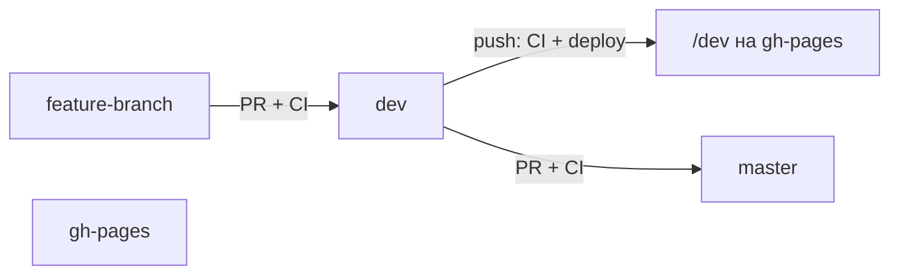

# Bible — правила разработки Simple4U (tutor-app)

Внутренний справочник команды. Следуй этим правилам при любых изменениях в репозитории.

---

## Git-ветки и CI/CD

В репозитории **три ветки**, у каждой своя роль:

| Ветка | Роль | Кто пишет в неё |
|-------|------|-----------------|
| `dev` | Исходный код, тестирование и **единственный источник сборки для gh-pages** | Через PR |
| `master` | Стабильный production-код (зеркало проверенного `dev`) | **Только через PR** из `dev` |
| `gh-pages` | Собранный статический сайт (артефакты деплоя) | Только GitHub Actions, **не коммить вручную** |

**Все изменения идут через PR → `dev`. Сборка на GitHub Pages — только из `dev`. После проверки — PR `dev` → `master`.**

### Порядок работы

1. **Feature-ветка** от `dev` → PR в `dev` → CI (тесты + build).
2. **Мерж PR в `dev`** → CI снова (тесты + build) → деплой в `gh-pages` (папка `/dev`).
3. **Проверка** — https://wrincied.github.io/tutor-app/dev
4. **PR `dev` → `master`** → CI (тесты + build), без деплоя.
5. **Мерж PR в `master`** — фиксация стабильной версии исходников. **Деплой не запускается.**

### CI/CD (GitHub Actions)

Один workflow: `.github/workflows/ci.yml`

| Событие | Jobs | Деплой |
|---------|------|--------|
| PR → `dev` | Test & Build | нет |
| PR → `master` | Test & Build | нет |
| push → `dev` | Test & Build → Deploy to GitHub Pages | `gh-pages` → `/dev` |
| push → `master` | — | **запрещён** (нет workflow-триггера) |

**URL после деплоя (только из `dev`):**

- https://wrincied.github.io/tutor-app/dev

### Обязательные настройки в GitHub

**Settings → Branches → Branch protection rules**

#### Для `dev`

1. **Require a pull request before merging**
2. **Require status checks to pass before merging** → **`Test & Build`**
3. **Require branches to be up to date before merging**

#### Для `master`

1. **Require a pull request before merging**
2. **Require status checks to pass before merging** → **`Test & Build`**
3. **Require branches to be up to date before merging**
4. **Do not allow bypassing the above settings**

> Без branch protection workflow запустится, но прямой push и мерж без тестов останутся возможны.

### Запрещено

- Пушить напрямую в `master` — только PR из `dev`.
- Пушить напрямую в `dev` без PR (после включения branch protection).
- Деплоить на `gh-pages` из `master` — деплой **только** из `dev`.
- Коммитить вручную в `gh-pages`.

### Репозиторий

- GitHub: https://github.com/wrincied/tutor-app
- Разработка и деплой: `dev`
- Стабильные исходники: `master` (без деплоя)
- Артефакты сайта: `gh-pages` (автоматически из `dev`)

---

*Обновляй этот документ при изменении процессов деплоя или ветвления.*
