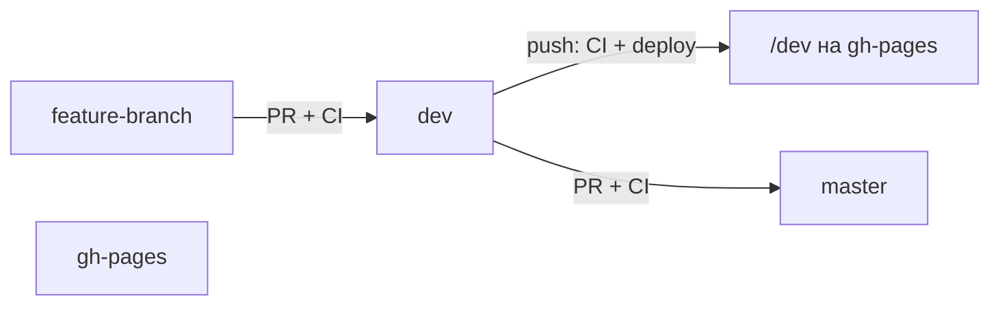

# Bible — правила разработки Simple4U (tutor-app)

Внутренний справочник команды. Следуй этим правилам при любых изменениях в репозитории.

---

## Git-ветки и CI/CD

В репозитории **три ветки**, у каждой своя роль:

| Ветка | Роль | Кто пишет в неё |
|-------|------|-----------------|
| `dev` | Исходный код, тестирование и **единственный источник сборки для gh-pages** | Через PR |
| `master` | Стабильный production-код (зеркало проверенного `dev`) | **Только через PR** из `dev` |
| `gh-pages` | Собранный статический сайт (артефакты деплоя) | Только GitHub Actions, **не коммить вручную** |

**Все изменения идут через PR → `dev`. Сборка на GitHub Pages — только из `dev`. После проверки — PR `dev` → `master`.**

### Порядок работы

1. **Feature-ветка** от `dev` → PR в `dev` → CI (тесты + build).
2. **Мерж PR в `dev`** → CI снова (тесты + build) → деплой в `gh-pages` (папка `/dev`).
3. **Проверка** — https://wrincied.github.io/tutor-app/dev
4. **PR `dev` → `master`** → CI (тесты + build), без деплоя.
5. **Мерж PR в `master`** — фиксация стабильной версии исходников. **Деплой не запускается.**



### CI/CD (GitHub Actions)

Один workflow: `.github/workflows/ci.yml`

| Событие | Jobs | Деплой |
|---------|------|--------|
| PR → `dev` | Test & Build | нет |
| PR → `master` | Test & Build | нет |
| push → `dev` | Test & Build → Deploy to GitHub Pages | `gh-pages` → `/dev` |
| push → `master` | — | **запрещён** (нет workflow-триггера) |

**URL после деплоя (только из `dev`):**

- https://wrincied.github.io/tutor-app/dev

### Структура GitHub Pages (простыми словами)

GitHub Pages — это **хостинг готового сайта** (HTML/JS), не сервер с API.

```
wrincied.github.io/tutor-app/          ← корень: редирект на /dev
wrincied.github.io/tutor-app/dev/      ← актуальная сборка (открывать это!)
wrincied.github.io/tutor-app/dev/#/login   ← вход
```

| Что | Где живёт |
|-----|-----------|
| Фронтенд (браузер) | `gh-pages` ветка → GitHub Pages |
| Исходный код | ветка `dev` в tutor-app |
| API, база, Stripe | `tutor-app-backend--tutorassis.europe-west4.hosted.app` |
| Production для пользователей | `simple4u-64822.web.app` |

**Цепочка:** PR → `dev` → CI собирает Angular → кладёт в `gh-pages/dev/` → сайт обновляется.

**Auth на gh-pages:** Firebase Authorized domain `wrincied.github.io` + OAuth Client JavaScript origin `https://wrincied.github.io`. Подробнее: [Linear doc](https://linear.app/simple4u/document/github-pages-struktura-i-avtorizaciya-wrinciedgithubio-f48efeed151c).

### Обязательные настройки в GitHub

**Settings → Branches → Branch protection rules**

#### Для `dev`

1. **Require a pull request before merging**
2. **Require status checks to pass before merging** → **`Test & Build`**
3. **Require branches to be up to date before merging**

#### Для `master`

1. **Require a pull request before merging**
2. **Require status checks to pass before merging** → **`Test & Build`**
3. **Require branches to be up to date before merging**
4. **Do not allow bypassing the above settings**

> Без branch protection workflow запустится, но прямой push и мерж без тестов останутся возможны.

### Запрещено

- Пушить напрямую в `master` — только PR из `dev`.
- Пушить напрямую в `dev` без PR (после включения branch protection).
- Деплоить на `gh-pages` из `master` — деплой **только** из `dev`.
- Коммитить вручную в `gh-pages`.

### Репозиторий

- GitHub: https://github.com/wrincied/tutor-app
- Разработка и деплой: `dev`
- Стабильные исходники: `master` (без деплоя)
- Артефакты сайта: `gh-pages` (автоматически из `dev`)

---

## Firebase: Hosting vs App Hosting

Два разных продукта Firebase. Конфиг: `firebase.json`. Команды запускают **вручную** (не из GitHub Actions CI выше).

### `firebase deploy --only hosting`

**Что это:** статический хостинг **фронтенда** (Angular SPA).

| | |
|--|--|
| Сайт | `simple4u-64822` |
| URL | https://simple4u-64822.web.app (и `*.firebaseapp.com`) |
| Папка публикации | `dist/tutor/browser` |
| Перед деплоем | `predeploy`: `npm run build:hosting` → `production-design` env + `ng build` |
| SPA | rewrite `**` → `/index.html` |

**Что делает команда:** собирает фронт локально → заливает HTML/JS/CSS на Firebase Hosting. **Backend / API не трогает.**

```bash
firebase deploy --only hosting
```

Отличие от GitHub Pages: gh-pages — превью из ветки `dev` (`/tutor-app/dev`); Firebase Hosting — **production-сайт для пользователей**.

### `firebase deploy --only apphosting` (и бэкенды)

**Что это:** Firebase **App Hosting** — деплой **серверных** приложений (Node), не статики.

В `firebase.json` два backend’а:

| `backendId` | `rootDir` | Назначение |
|-------------|-----------|------------|
| `tutor-app` | `.` (корень фронт-репо) | App Hosting backend с id `tutor-app` |
| `tutor-app-backend` | `backend/` | Express API (отдельный backend) |

Типичный production API:

- https://tutor-app-backend--tutorassis.europe-west4.hosted.app

**Примеры:**

```bash
# оба App Hosting backend’а из firebase.json
firebase deploy --only apphosting

# только API
firebase deploy --only apphosting:tutor-app-backend

# только backend id tutor-app
firebase deploy --only apphosting:tutor-app
```

**Hosting ≠ App Hosting:**  
`hosting` = CDN со статикой Angular.  
`apphosting` = контейнер/рантайм с серверным кодом (API и т.п.).

| Цель | Команда |
|------|---------|
| Обновить production-фронт | `firebase deploy --only hosting` |
| Обновить API (backend) | `firebase deploy --only apphosting:tutor-app-backend` |
| Превью для команды | merge в `dev` → CI → GitHub Pages `/dev` |

---

*Обновляй этот документ при изменении процессов деплоя или ветвления.*
