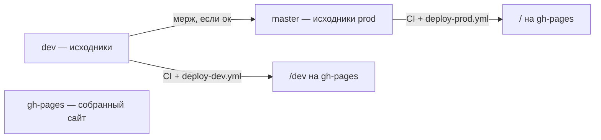

# Bible — правила разработки Simple4U (tutor-app)

Внутренний справочник команды. Следуй этим правилам при любых изменениях в репозитории.

---

## Git-ветки и CI/CD

В репозитории **три ветки**, у каждой своя роль:

| Ветка | Роль | Кто пишет в неё |
|-------|------|-----------------|
| `dev` | Исходный код для разработки и тестирования | Разработчики |
| `master` | Исходный код production | Только через мерж из `dev` |
| `gh-pages` | Собранный статический сайт (артефакты деплоя) | Только GitHub Actions, **не коммить вручную** |

**Все изменения сначала идут в `dev`. Сборка из `dev` деплоится на GitHub Pages. Если всё ок — `dev` мержится в `master`.**

### Порядок работы

1. **Разработка** — feature-ветка от `dev` или коммиты напрямую в `dev`.
2. **Push в `dev`** — CI (тесты + build) и деплой dev-сборки в ветку `gh-pages` (папка `/dev`).
3. **Проверка** — открой https://wrincied.github.io/tutor-app/dev и убедись, что всё работает.
4. **Мерж `dev` → `master`** — только после успешной проверки на gh-pages dev.
5. **Push в `master`** — CI и production-деплой в `gh-pages` (корень сайта).

### CI/CD (GitHub Actions)

| Исходная ветка | Workflow | Триггер | Куда деплоится |
|----------------|----------|---------|----------------|
| `dev`, `master` | `.github/workflows/ci.yml` | pull request и push | — (только проверки) |
| `dev` | `.github/workflows/deploy-dev.yml` | push в `dev` | `gh-pages` → `/dev` |
| `master` | `.github/workflows/deploy-prod.yml` | push в `master` | `gh-pages` → `/` (prod) |

**URL после деплоя:**

- Dev (из `dev`): https://wrincied.github.io/tutor-app/dev
- Prod (из `master`): https://wrincied.github.io/tutor-app

### Обязательные проверки перед мержем PR

В GitHub: **Settings → Branches → Branch protection rules** для `dev` и `master`:

1. Включи **Require a pull request before merging**
2. Включи **Require status checks to pass before merging**
3. Выбери check **`Test & Build`** (job из `ci.yml`)
4. (Рекомендуется) **Require branches to be up to date before merging**

Без этих настроек workflow запустится, но мерж PR не будет заблокирован при падении тестов.

### Запрещено

- Пушить непроверенные изменения напрямую в `master`, минуя `dev`.
- Мержить `dev` → `master` без проверки dev-сборки на `gh-pages`.
- Коммитить вручную в `gh-pages` — эта ветка управляется только CI/CD.

### Репозиторий

- GitHub: https://github.com/wrincied/tutor-app
- Ветки исходного кода: `dev` (разработка), `master` (production)
- Ветка деплоя: `gh-pages` (автоматически)

---

*Обновляй этот документ при изменении процессов деплоя или ветвления.*
