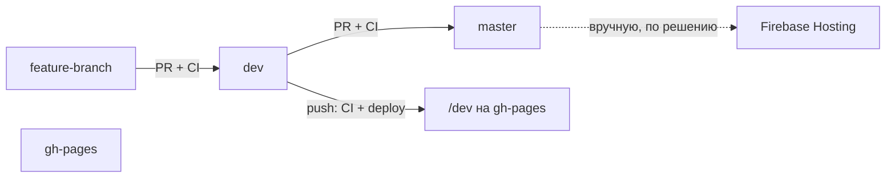

# Bible — правила разработки Simple4U (tutor-app)

Внутренний справочник команды. Следуй этим правилам при любых изменениях в репозитории.

---

## Продукт и URL

| Что | URL |
|-----|-----|
| **Production (пользователи)** | https://simple4u.at |
| Hosting alias | https://simple4u-64822.web.app |
| **API (App Hosting)** | https://tutor-app-backend--tutorassis.europe-west4.hosted.app |
| Превью команды (gh-pages) | https://wrincied.github.io/tutor-app/dev |
| GitHub | https://github.com/wrincied/tutor-app |

Firebase project: `tutorassis`. Hosting site: `simple4u-64822`.

Публичные маркетинговые страницы: `/` (landing-v2), `/pricing`, `/login`, `/register`, legal.

---

## Git-ветки и CI/CD

В репозитории **три ветки**, у каждой своя роль:

| Ветка | Роль | Кто пишет в неё |
|-------|------|-----------------|
| `dev` | Исходный код, тестирование и **единственный источник сборки для gh-pages** | Через PR |
| `master` | Стабильный production-код (зеркало проверенного `dev`) | **Только через PR** из `dev` |
| `gh-pages` | Собранный статический сайт (артефакты деплоя) | Только GitHub Actions, **не коммить вручную** |

**Все изменения идут через PR → `dev`. Сборка на GitHub Pages — только из `dev`. После проверки — PR `dev` → `master`.**

Firebase Hosting (`simple4u.at`) **не** деплоится из CI — только вручную (см. ниже).

### Порядок работы

1. **Feature-ветка** от `dev` → PR в `dev` → CI (тесты + build).
2. **Мерж PR в `dev`** → CI снова → деплой в `gh-pages` (папка `/dev`).
3. **Проверка** — https://wrincied.github.io/tutor-app/dev
4. **PR `dev` → `master`** → CI (тесты + build), без деплоя.
5. **Мерж PR в `master`** — фиксация стабильных исходников. **Деплой Firebase не запускается.**
6. **Production-фронт** — вручную: `firebase deploy --only hosting --project tutorassis` (когда явно решено выкатить).


```mermaid
flowchart LR
  Feature[feature-branch]
  Dev[dev]
  Master[master]
  GhPages[gh-pages]
  Hosting[Firebase Hosting]

  Feature -->|PR + CI| Dev
  Dev -->|push: CI + deploy| GhPagesDev["/dev на gh-pages"]
  Dev -->|PR + CI| Master
  Master -.->|вручную, по решению| Hosting
```

### CI/CD (GitHub Actions)

Один workflow: `.github/workflows/ci.yml`

| Событие | Jobs | Деплой |
|---------|------|--------|
| PR → `dev` | Test & Build | нет |
| PR → `master` | Test & Build | нет |
| push → `dev` | Test & Build → Deploy to GitHub Pages | `gh-pages` → `/dev` |
| push → `master` | — | **запрещён** (нет workflow-триггера) |

### Структура GitHub Pages

```
wrincied.github.io/tutor-app/          ← корень: редирект на /dev
wrincied.github.io/tutor-app/dev/      ← актуальная сборка из ветки dev
```

**Auth на gh-pages:** Firebase Authorized domain `wrincied.github.io` + OAuth Client JavaScript origin `https://wrincied.github.io`.

### Branch protection (GitHub)

**`dev` и `master`:** Require PR, Require status check **`Test & Build`**, Require branches up to date.  
Для `master` — также **Do not allow bypassing**.

### Запрещено

- Пушить напрямую в `master` / `dev` без PR (после protection).
- Деплоить на `gh-pages` из `master` или коммитить в `gh-pages` вручную.
- Деплоить Firebase Hosting / App Hosting **без явной просьбы** владельца (агент / автоматика в чате).

---

## Environments (фронтенд)

Код импортирует только `@environment` → `src/environments/environment.ts`.

**`environment.ts` не коммитится** (в `.gitignore`). Это рабочая копия: скрипт `prepare-environment.mjs` перед `dev:*` / билдом **копирует** нужный файл поверх неё. Править руками `environment.ts` бессмысленно — правь именованные файлы.

| Файл (источник) | Команда | Порт | API | `authDomain` |
|-----------------|---------|------|-----|--------------|
| **`environment.production.ts`** | `build:hosting` / `start:prod` | — / 4400 | remote | **`simple4u.at`** |
| **`environment.development-local.ts`** | `npm run dev:local` | **4200** | **`localhost:3001`** | `web.app` |
| **`environment.development-remote.ts`** | `npm run dev:remote` | **4200** | remote | `web.app` |
| `environment.template.ts` | — | — | — | шаблон / плейсхолдеры |

У всех рабочих конфигов `designMode: true` → landing-v2 + `design-v2` стили.

### Auth

- Прод: `authDomain` / `appUrl` = `simple4u.at`.
- Локально: только `simple4u-64822.web.app`. Не ставь `simple4u.at` на localhost.
- `start:prod` (:4400) = production-конфиг — OAuth с localhost обычно ломается.

### Команды дня

```bash
# Фронт :4200 + свой API :3001
cd backend && node server.js
npm run dev:local

# Фронт :4200 + боевой API
npm run dev:remote

# Production-фронт (только по решению)
npm run build:hosting
firebase deploy --only hosting --project tutorassis
```

---

## Firebase: Hosting vs App Hosting

Конфиг: `firebase.json`. Команды — **вручную** (не из GitHub Actions для Firebase).

### `firebase deploy --only hosting`

Статический **фронтенд** (Angular SPA).

| | |
|--|--|
| Site | `simple4u-64822` |
| URL | https://simple4u.at · https://simple4u-64822.web.app |
| Папка | `dist/tutor/browser` |
| Predeploy | `npm run build:hosting` → `prepare-environment production` + `ng build --configuration=production` |
| SPA | rewrite `**` → `/index.html` |

**Backend не трогает.**

```bash
firebase deploy --only hosting --project tutorassis
```

| Канал | Роль |
|-------|------|
| GitHub Pages `/dev` | Превью из ветки `dev` |
| Firebase Hosting | **Production** для пользователей |

### `firebase deploy --only apphosting`

Серверный рантайм (Node), не статика.

| `backendId` | `rootDir` | Назначение |
|-------------|-----------|------------|
| `tutor-app` | `.` | App Hosting id `tutor-app` (корень фронт-репо) |
| `tutor-app-backend` | `backend/` | Express API |

```bash
firebase deploy --only apphosting:tutor-app-backend --project tutorassis
```

CORS для локальных origin’ов: `backend/src/utils/corsOrigins.js` и `backend/apphosting.yaml` (`FRONTEND_URL`) — `localhost:4200`, `:4300`, `:4400` (+ production-домены). После смены списка CORS нужен redeploy API.

---

## Вложенные репозитории

| Папка | Отдельный git | Remote |
|-------|---------------|--------|
| `backend/` | да | `tutor-app-backend` |
| `bot/` | да | `tutor-app-bot` |

Коммиты/PR в nested-репо — отдельно от фронта. Не путать ветки: фронт → `dev`/`master`, backend обычно → `master`.

---

## Telegram bot (`bot/`)

Python-бот: уведомления ученику (баланс, оплата, урок, ДЗ, перенос), меню.

```bash
cd bot
python -m venv .venv
.venv\Scripts\activate   # или source .venv/bin/activate
pip install -e ".[dev]"
cp .env.example .env
simple4u-bot
```

HTTP API для Express: `POST /v1/notify/...` + `X-Bot-Secret`. Подробности: `bot/README.md`.

---

## Правила для агентов / автоматизации

1. **Не деплоить** на Firebase Hosting / App Hosting и не пушить в remote, пока пользователь явно не попросил.
2. **Не коммитить**, пока пользователь явно не попросил.
3. Изменения только через PR в `dev` (не прямой push в `master`).
4. При путанице с env — сверяйся с таблицей Environments выше; не изобретай новые `environment.*.ts` без нужды.
5. Обновляй этот документ при смене веток, деплоя или env-схемы.

---

*Последнее обновление: environments local/remote, production = designMode, simple4u.at, запрет автодеплоя без запроса.*
