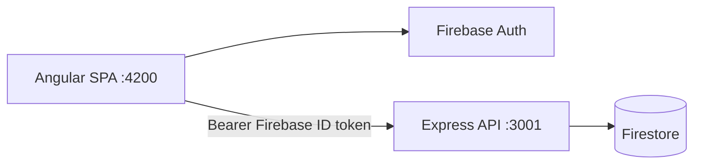

# Simple4U — Frontend

**Simple4U** is a web application (CRM and scheduler) for private tutors: manage students, plan lessons, track finances, and subscribe to Pro. The client is an **Angular 21** SPA with a multilingual UI, deployed on **Firebase Hosting** and **Firebase App Hosting**.

**Link: https://simple4u-64822.web.app/** 

Companion API documentation: [backend/README.md](./backend/README.md).

---

## Product overview

| Audience | Goal |
|----------|------|
| Tutor | Maintain a student base, schedule and reschedule lessons, view income and expenses |
| Super admin | Manage subscriptions and user statistics |

### Key UI capabilities

- **Authentication** — sign up and sign in with **Firebase Authentication** (email/password)
- **Onboarding** — country, timezone, data-processing consent, tax mode
- **Students** — hourly rates, currencies, lesson package balance, balance change history
- **Calendar** — 1 / 3 / 7 / 30 day views, drag-and-drop lessons, recurring events (RRULE), student focus filter, working hours from profile
- **Finance** — period summary, expenses, report currency conversion, tax estimates (including Austria)
- **Home** — welcome screen and today’s KPIs
- **Pricing** — Pro subscription via Stripe Checkout
- **Account** — profile, workspace customization, subscription, tax settings
- **Legal** — data processing and cookie policies
- **Theming** — light / dark mode; **6 languages**: Russian, English, German, Kazakh, Ukrainian, Belarusian

---

## Tech stack

| Category | Technologies |
|----------|--------------|
| Framework | Angular 21 (standalone components, signals, lazy-loaded routes) |
| Styling | SCSS, Tailwind CSS 4, CSS variables for theming |
| Auth & SDK | `@angular/fire`, Firebase Auth / Analytics / Firestore (client SDK) |
| HTTP | `HttpClient` + interceptors → REST API |
| Recurrence | `rrule` (aligned with backend recurrence logic) |
| Tests | Vitest + jsdom |
| Build | `@angular/build`, production output → `dist/tutor/browser` |

Application data (students, lessons, finance) is loaded through the **REST API**, not directly from Firestore security rules on the client. Firebase on the frontend is used for authentication and analytics.

---

## Architecture



---

## Project structure

```
tutor/                              # frontend root
├── src/
│   ├── app/
│   │   ├── app.routes.ts           # routes and guards
│   │   ├── core/
│   │   │   ├── services/           # auth, lesson, student, finance, billing, i18n…
│   │   │   ├── guards/             # auth, email verified, onboarding, admin
│   │   │   ├── interceptors/       # Bearer token, email verification
│   │   │   ├── i18n/locales/       # uk, by (+ built-in ru/en/de/kz)
│   │   │   └── utils/              # calendar, finance, recurrence…
│   │   ├── features/
│   │   │   ├── landing/            # marketing landing
│   │   │   ├── auth/               # login, register, onboarding, verify-email
│   │   │   ├── home/               # dashboard
│   │   │   ├── students/           # student CRUD
│   │   │   ├── calendar/           # schedule
│   │   │   ├── finance/            # reports and expenses
│   │   │   ├── pricing/            # plans
│   │   │   ├── account/            # profile and settings
│   │   │   ├── admin/              # super-admin panel
│   │   │   └── legal/              # GDPR / cookies
│   │   └── shared/                 # navbar, dialog, select, activity-log…
│   ├── assets/
│   │   └── Interfaces.ts           # shared TypeScript types (@interfaces)
│   ├── environments/               # apiUrl, firebase config
│   └── styles/                     # global SCSS + Tailwind
├── public/                         # static assets
├── angular.json
├── package.json
└── firebase.json                   # Hosting + App Hosting (backendId: tutor-app)
```

---

## Application routes

| URL | Screen | Access |
|-----|--------|--------|
| `/` | Landing | public |
| `/login`, `/register` | Sign in / sign up | public |
| `/legal/*` | Legal documents | public |
| `/app/verify-email-notice` | Email verification reminder | authenticated |
| `/app/onboarding` | Initial setup | email verified |
| `/app/home` | Home | full access |
| `/app/students` | Students | full access |
| `/app/calendar` | Calendar | full access |
| `/app/finance` | Finance | full access |
| `/app/pricing` | Pricing | full access |
| `/app/account/*` | Account | full access |
| `/app/admin` | Admin panel | super-admin |

**Guard chain:** `authGuard` → `emailVerifiedGuard` → `dataConsentGuard` → `onboardingGuard`.

---

## Quick start (local)

### Prerequisites

- Node.js **20+**
- npm **11+** (see `packageManager` in `package.json`)
- [Backend API](./backend/README.md) running on port **3001**
- Firebase project with **Email/Password** authentication enabled

### 1. Install dependencies

```bash
cd tutor
npm install
```

### 2. Environment

Copy the template and fill in Firebase client config and API URL:

```bash
cp src/environments/environment.template.ts src/environments/environment.development.ts
```

Minimum fields in `environment.development.ts`:

```ts
export const environment = {
  production: false,
  apiUrl: 'http://localhost:3001',
  appUrl: 'http://localhost:4200',
  firebase: { /* Firebase Console → Project settings */ },
};
```

`src/environments/environment.ts` is used for production builds. Do not commit secrets; Firebase client keys are public by design but should be restricted in the Firebase Console.

### 3. Run

```bash
# Terminal 1 — API (see backend/README.md)
cd backend && npm run dev

# Terminal 2 — frontend
npm start
# → http://localhost:4200
```

### 4. Build and test

```bash
npm run build          # production → dist/tutor/browser
npm run build:dev      # development build
npm test               # Vitest
npm run test:backend   # API tests from frontend root
```

---

## API integration

- Base URL: `environment.apiUrl` (default `http://localhost:3001`)
- Paths: `/api/auth`, `/api/students`, `/api/lessons`, `/api/finance`, `/api/billing`, `/api/admin`
- `authInterceptor` adds `Authorization: Bearer <Firebase ID token>` only for requests to `/api/`

Shared domain types: `src/assets/Interfaces.ts` (path alias `@interfaces` in `tsconfig`).

---

## Deployment

| Environment | Method |
|-------------|--------|
| Static hosting | `firebase deploy --only hosting` (site: `simple4u-64822`, `predeploy`: `npm run build`) |
| App Hosting | `firebase.json` → `apphosting.backendId: tutor-app`, root `.` |

Production API URL and CORS are configured on the backend (`FRONTEND_URL`). Example production frontend URL: `https://simple4u-64822.web.app`.

---

## Demo flow (presentation)

Suggested screens for a live demo:

1. **Calendar** — week view, drag a lesson, open recurrence modal
2. **Students** — card with hourly rate and package balance
3. **Finance** — KPIs and period filter (month / quarter / year)
4. **Account** — workspace, working hours, Pro subscription status
5. **Navbar** — language and theme switcher

---

## Useful commands

| Command | Description |
|---------|-------------|
| `npm start` | `ng serve` — dev server on :4200 |
| `npm run build` | Production build |
| `npm test` | Vitest unit tests |
| `ng generate component …` | Angular CLI scaffolding |

---

## Related documentation

- [Backend API — README]([./backend/README.md](https://github.com/wrincied/tutor-app-backend/blob/master/README.md))


---

*Simple4U — CRM and scheduler for tutors. Frontend: Angular 21 + Firebase Auth + REST.*
